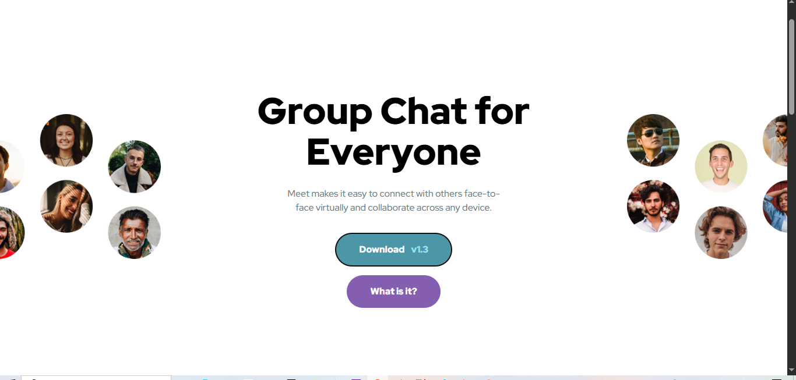
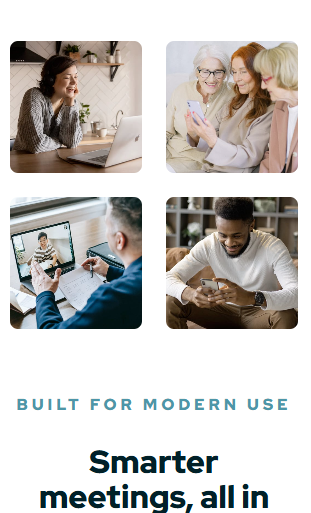

# Frontend Mentor - Meet Landing Page Solution

This is a solution to the [Meet landing page challenge on Frontend Mentor](https://www.frontendmentor.io/challenges/meet-landing-page-819y9be7d). Frontend Mentor challenges help you improve your coding skills by building realistic projects.

## Table of contents

- [Overview](#overview)
  - [The challenge](#the-challenge)
  - [Screenshot](#screenshot)
  - [Links](#links)
- [My process](#my-process)
  - [Built with](#built-with)
  - [What I learned](#what-i-learned)
  - [Continued development](#continued-development)
- [Author](#author)

## Overview

### The challenge

Users should be able to:

- View the optimal layout depending on their device's screen size
- See hover states for interactive elements
- Experience a fully accessible interface with semantic HTML

### Screenshot




### Links

- Solution URL: [https://github.com/BaskoroR725/08-meet-landing-page.git](https://github.com/BaskoroR725/08-meet-landing-page.git)
- Live Site URL: [https://baskoror725.github.io/08-meet-landing-page/](https://baskoror725.github.io/08-meet-landing-page/)

## My process

### Built with

- Semantic HTML5 markup
- **Sass (SCSS)** - Using modern `@use` rules and 7-1 Architecture pattern
- **BEM (Block Element Modifier)** - For clean and maintainable naming conventions
- **CSS Grid & Flexbox** - For complex responsive layouts
- **Mobile-first workflow**
- **Modern CSS Units** - Utilizing `rem`, `clamp()`, and logical properties for fluid typography and spacing

### What I learned

During this project, I focused on "Engineering over Speed." I learned how to structure a project professionally without relying on heavy frameworks.

**Key takeaway: Fluid Typography**
I implemented `clamp()` to ensure headings look great on both mobile and desktop without excessive media queries:

```css
.section-title {
  font-size: clamp(2rem, 4vw, 2.5rem);
}
```

**Key takeaway: Defensive CSS**
I used aspect-ratio and object-fit to ensure the gallery grid remains stable regardless of the original image dimensions.

### Continued development

In future projects, I want to:

- Deepen my knowledge of CSS Grid for even more complex layouts.

- Integrate Framer Motion for subtle entrance animations.

- Refine my Accessibility (a11y) skills, specifically screen reader testing.

### Author

Baskoro Ramadhan
